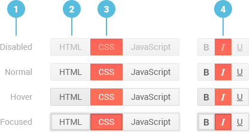

# ButtonGroup Overview

The Kendo UI ButtonGroup for React is a container for two or more Kendo UI Button components. Each Button can be separately configured depending on your project requirements and according to the [Button client-side API]().

The ButtonGroup is a component that is part of the Buttons `npm` package of the Kendo UI suite for React.

**Figure 1: A ButtonGroup template displaying text and an icon as a background image**



1. ButtonGroup interaction states
2. Default Buttons
3. Primary Buttons
4. ButtonGroup with togglable Buttons

## Demos

### Default Setup

The example below demonstrates how to configure a togglable Kendo UI ButtonGroup for React.

```html-preview
    <div id="app"></div>
```
```jsx
    ReactDOM.render(
        <KendoReactButtons.ButtonGroup>
            <KendoReactButtons.Button togglable icon="bold" />
            <KendoReactButtons.Button togglable icon="italic" />
            <KendoReactButtons.Button togglable icon="underline" />
        </KendoReactButtons.ButtonGroup>,
        document.getElementById('app')
    );
```

## Configuration

### Enable and Disable

By default, the Kendo UI ButtonGroup for React is enabled.

```html
    <div id="app"></div>
```
```jsx
    ReactDOM.render(
        <KendoReactButtons.ButtonGroup>
            <KendoReactButtons.Button>Button 1</KendoReactButtons.Button>
            <KendoReactButtons.Button>Button 2</KendoReactButtons.Button>
            <KendoReactButtons.Button>Button 3</KendoReactButtons.Button>
        </KendoReactButtons.ButtonGroup>,
        document.getElementById('app')
    );
```

When disabled, the ButtonGroup is displayed but does not function.

```html
    <div id="app"></div>
```
```jsx
    ReactDOM.render(
        <KendoReactButtons.ButtonGroup disabled>
            <KendoReactButtons.Button>Disabled Button 1</KendoReactButtons.Button>
            <KendoReactButtons.Button>Disabled Button 2</KendoReactButtons.Button>
            <KendoReactButtons.Button>Disabled Button 3</KendoReactButtons.Button>
        </KendoReactButtons.ButtonGroup>,
        document.getElementById('app')
    );
```

For detailed information on the Kendo UI ButtonGroup configuration for React, refer to the [ButtonGroup client-side API documentation]().

## Keyboard Navigation

Below is the list with the keyboard shortcuts the ButtonGroup supports.

| SHORTCUT                            | DESCRIPTION         |
|:---                                 |:---                 |
| `Tab`                               | Focus a specific Button from the ButtonGroup. |

## Accessibility

The ButtonGroup is WAI ARIA-accessible through the `Tab` key. The `aria-disabled` option defines the accessibility setting when an attribute is disabled.

## Suggested Links

* [API Reference of the ButtonGroup Component]()
